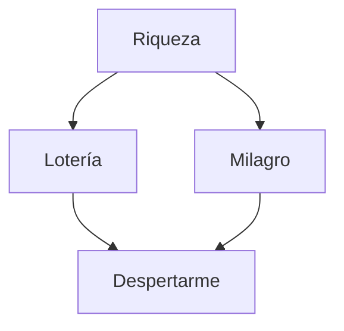

# MarkDown

Mi nombre es[^1].

Vivo en[^2].  

Me gusta[^note].

### **DIFERENTES _TIPOS_**
<sub>Todos o puede que no ;)</sub>

<sub>No, en verdad todos creo</sub>


Una nota probable sería:
```
10
```
O...
```
9.99
```

El color de fondo de _issues_ debería ser `#RRGGBB`.

Este MarkDown pertenece a [Adrían](https://github.com/agonzalezbesada)

### REPOSITORIOS DE ADRIÁN ###

[Mejor foto de perfil de la historia](https://github.com/agonzalezbesada/MarkDown/blob/main/Yoda%20pocho.jpg)
>Y lo sabes

Por si no eres curioso, es **esta**.


<picture>
  <source media="(prefers-color-scheme: dark)" srcset="https://i.pinimg.com/originals/ef/fa/fb/effafbadfb79dbd9e8b38f6562c7c0b6.jpg">
  <source media="(prefers-color-scheme: light)" srcset="https://p4.wallpaperbetter.com/wallpaper/78/201/193/star-wars-yoda-jedi-hd-wallpaper-preview.jpg">
  
</picture>

**Comidas del día**
- Cena
- Desayuno
- comida

**Comidas del día ordenadas**

1. Desayuno
2. Comida
3. Cena

Ahora una pequeña lista

1. Cosas que tengo que hacer hoy
   * SI/Binario
   * LMXSI/MarkDown
     - Voy por la mitad creo
     
- [x] SI/Binario
- [x] LMXSI/MarkDown
- [ ] Hacerme rico
- [x] Despertarme

:sunglasses:


[^1]: Adrián
[^2]: Cambados  
[^note]:
    Quedar con mis amigos, el deporte y jugar videojuegos

<!-- Ahora voy a intentar hacer el diagrama, a ver qué tal sale -->

Intento de \*Diagrama\*




